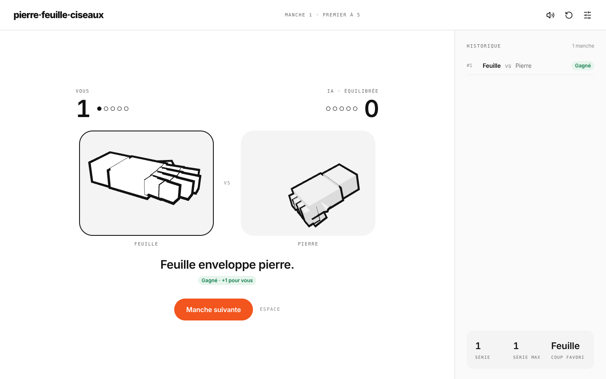

# ✊ Pierre · Feuille · Ciseaux ✋✌️

Défiez une intelligence artificielle qui apprend vos habitudes, dans une interface sobre et moderne inspirée du design system **Alloy** : mains 3D animées, sons 8-bit, et une mise en page pensée pour chaque écran — téléphone, tablette, PC et TV.

Développé en **HTML5**, **CSS3** et **JavaScript pur** (aucun framework).

🌐 **Jouer en ligne** : [https://Novagenesys4.github.io/pierre.feuille.ciseaux](https://Novagenesys4.github.io/pierre.feuille.ciseaux)



---

## 🎮 Fonctionnalités

- 🧭 **Trois écrans** : Réglages → Partie → Récapitulatif de fin de match.
- 🖐️ **Mains 3D en voxels** (three.js) : la main tremble pendant que l'IA réfléchit, le gagnant avance, le perdant s'affaisse. Repli automatique sur des emojis si WebGL n'est pas disponible.
- 🤖 **3 adversaires** :
  - **Distraite (Facile)** : joue vite et se trompe souvent.
  - **Équilibrée (Normale)** : joue au hasard.
  - **Prédictive (Difficile)** : analyse vos enchaînements (chaîne de Markov) et vos coups favoris pour vous contrer.
- 🏆 **Formats** : Premier à 3, Premier à 5 ou Libre, avec pastilles de progression.
- 📜 **Historique** des 10 dernières manches + statistiques : série en cours, série max, coup favori.
- 🏁 **Fin de match** en thème noir : score final, nombre de manches, série max, coup favori, frise « manche par manche » (G / P / N) et confettis en cas de victoire.
- 🔊 **Sons 8-bit** générés en temps réel (Web Audio API, 0 fichier audio) + vibration légère sur mobile.
- 💾 Format, adversaire et son sont **mémorisés** d'une visite à l'autre.
- ♿ Focus clavier visible, annonces `aria-live`, respect de « réduire les animations ».

---

## 📱 Formats d'écran

| Format | Mise en page |
| :--- | :--- |
| **Téléphone (portrait)** | « Pouce d'abord » : coups en bas de l'écran, résultat dans une feuille qui monte, historique derrière l'icône horloge (glisser vers le bas pour fermer). |
| **Téléphone (paysage)** | Face-à-face à gauche, message et coups à droite. |
| **Tablette** | Face-à-face centré, historique en tiroir. |
| **PC / grand écran** | Face-à-face + panneau d'historique permanent à droite. |
| **TV** | Tout s'agrandit automatiquement (1080p, 1440p, 4K) et se pilote à la **télécommande** (flèches + OK). |

---

## ⌨️ Raccourcis clavier

| Touche | Action |
| :--- | :--- |
| `1` ou `P` | Jouer **Pierre** |
| `2` ou `F` | Jouer **Feuille** |
| `3` ou `C` | Jouer **Ciseaux** |
| `Espace` ou `Entrée` | Lancer le match / **Manche suivante** / Revanche |
| `R` | **Recommencer** le match |
| `M` | Activer / couper le **son** |
| `H` | Ouvrir / fermer l'**historique** (mobile, tablette) |
| `Échap` | Fermer l'historique |
| `← ↑ → ↓` | Naviguer entre les boutons (clavier ou télécommande TV) |

---

## 🗂️ Structure

```
index.html
assets/
  css/alloy.css     → design system Alloy (couleurs, typo, composants)
  css/app.css       → mise en page responsive
  js/game.js        → logique du jeu, IA, rendu, navigation
  js/hands.js       → composant <pfc-hand> (mains 3D)
  js/sound.js       → moteur sonore 8-bit
  vendor/three.min.js
```

---

## 🖥️ Technologies

| Technologie | Rôle |
| :--- | :--- |
| **HTML5** | Structure sémantique, Custom Element `<pfc-hand>`, canvas des confettis |
| **CSS3** | Design Alloy, media queries téléphone → TV, unités `rem` pour la mise à l'échelle |
| **JavaScript (ES6+)** | Logique de jeu, IA prédictive, navigation spatiale au clavier / télécommande |
| **three.js** | Rendu 3D toon des mains |
| **Web Audio API** | Synthèse des sons 8-bit |
| **Google Fonts** | *Figtree* & *DM Mono* |

---

## 🚀 Lancement en local

1. Clonez le dépôt :
   ```bash
   git clone https://github.com/Novagenesys4/Pierre.Feuille.Ciseau.git
   ```
2. Ouvrez simplement `index.html` dans votre navigateur (aucune installation requise).

---

✌️ *Développé par Néhémie Kouassi*
